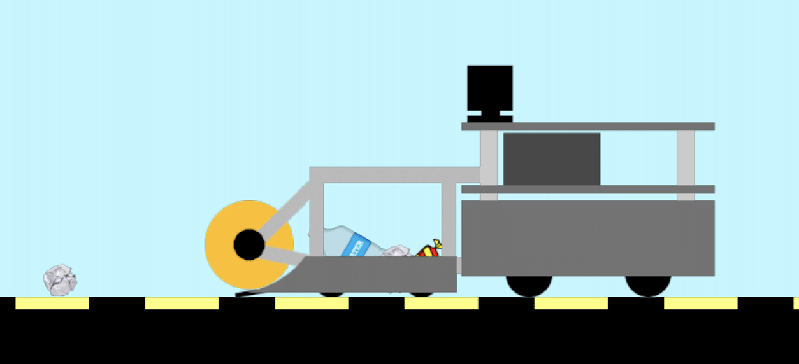
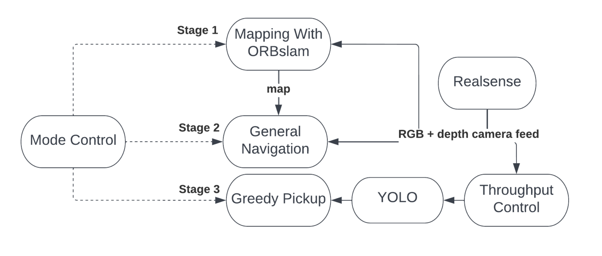
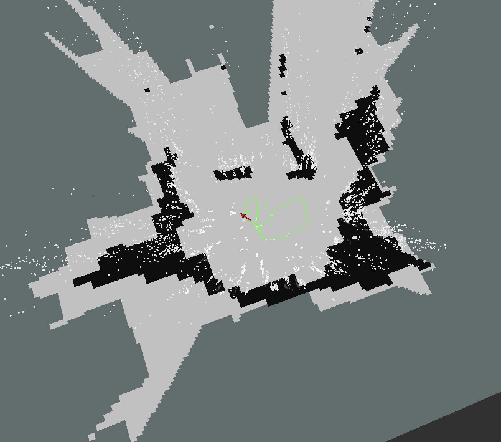
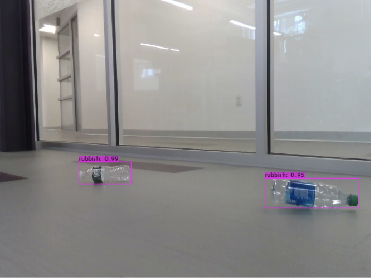

# Terrestrial Roving Autonomous Scrap Harvester (TRASH)

Welcome to the home repository for Northeastern's EECE Capstone team named TRASH. The TRASH system is a robotics project designed to map out and pick up trash in a particular area. This file serves as a full guide to getting our codebase set up on your own machine.



# README Outline

1. [INTRODUCTION](#1-introduction)
2. [EXPECTED KNOWLDGE](#2-expected-knowldege)
    - Ubuntu 16.04
    - ROS (Kintetic)
3. [Project Setup Instructions](#3-setup-instructions)
    - Initial Downloads
      1. [Clone This Repository](#clone-this-repository)
      2. [General Dependencies](#general-dependencies)
    - Repository Components
      1. [Build ORB-SLAM2](#install-orb-slam2)
      2. [Build YOLOv4](#install-yolov4)
4. [Project Run Instructions](#4-project-run-instructions)
    - [Run ORB-SLAM2](#run-orb-slam2)
    - [Run YOLOv4](#run-yolov4)

5. [Contact Us](#contact)


# 1. Introduction

TRASH was designed as an application of robotics to the ever-present problem of trash collection. We focused our approach on litter pickup, particularly in spaces like highway shoulders and parking lots. Our approach focused on creating a modular solution that was not dependent on a particular implementation. We first map a space and identify the trash and then pick it up, which could be done by a heterogeneous two-robot system (like a mapping drone and a ground collection robot). However, since this is just a proof of concept we are only using a single robot. We use the TurtleBot2, which is essentially a Roomba for research, and custom designed a collection mechanism fastened to the front.

Take a look at the [Final Project Document](Capstone_Project_Writeup.pdf) for a full understanding of the scope, goals, approach taken, and results of this project.


### Software Overview

Each one of the software packages that make up different parts of the project are connected using ROS. Robot Operating System (ROS) is an open-source robotics middleware suite that handles communication between "nodes". Each node is able to publish data of different types that any other node in the network can subscribe to.

The TRASH system’s software has three distinct stages (as seen below).

In the first stage, the TRASH system maps its environment using a customized version of ORB-SLAM2, an open source Visual SLAM solution which can accurately create point clouds given RGB and depth camera input. We trained YOLO, an image identification CNN, with our own dataset, then using it to identify and mark the locations of trash clusters on the map. We then render the 3D point cloud down to a 2D occupancy grid using a custom implementation of Octomap. It is from this 2D occupancy grid that the robot can navigate around an environment.

Once the mapping stage is over, the TRASH system enters its second stage: general navigation.The Turtlebot uses adaptive Monte Carlo localization (AMCL) to locate itself in the built map. That way it can identify obstacles and path plan around them to the trash cluster points labeled in that map.
Upon reaching a cluster, the third stage begins. YOLO identifies trash in the RGB image from the Realsense Camera, and from the coordinates of the trash detection and the distance measurement received from the depth camera, calculates the position of the trash relative to the robot. Once it identifies the relative position of the trash, the robot turns towards its target, starts the collection mechanism motor, and moves towards it, picking up the trash piece. Upon successful collection, it returns to the general navigation stage, repeating on until all trash clusters have been visited.


Each ROS node in our network is represented by their own bubble


&nbsp; 

---
---

&nbsp; 


## 2. Expected Knowldege


This project uses a number of advanced technical solutions, but most of these do not need to be understood at least while setting up the code base.

1.  This project must be run on the Linux operating system Ubuntu (specifically 16.04). This project expects that you have some familiarity with Unix operating systems. If you do not already have Ubuntu 16.04 set up, you will need to create a virtual machine. I suggest [VMware Fusion](https://www.vmware.com/products/fusion.html) to run your [Ubuntu image](https://releases.ubuntu.com/16.04/). For more expansive directions look [here](https://graspingtech.com/vmware-fusion-ubuntu-18.04/). **You MUST use Ubuntu 16.04**

2.  Ubuntu 16.04 is end-of-life and no longer supported but any recent software updates, but our robot was unable to use anything newer. Most of the issues we ran into on the software front of this project stem from this fact. We were unable to update ROS beyond ros-kinetic and Python3 beyong Python3.5, which each cause a number of issues in themselves. 

3.  ROS is essential to how the components of this project fit together. If you have never heard of or used ROS before, it may be worth reading up about it or doing some of the tutorials found on the [ROS website](http://wiki.ros.org/ROS/Introduction). However you must use [these instructions] to install ros-kinetic; DO NOT install ROS using the instructions from their website.

4.  As is already evidenced by the format of this document, Github is an essential tool in setting up this project. We use git submodules, which allow for multiple git repositories to be linked whtin a single one. We use this parent repository to automatically structure all the dependent repositories for you. Look [here](https://git-scm.com/book/en/v2/Git-Tools-Submodules) to learn more about submodules.

5.  Though not essential to getting the codebase set up, knowledge of robotics techniques SLAM and Computer Vision would be very helpful understanding what is being done in this project. To learn more about these respective topics you can read their papers: [ORB-SLAM2](http://webdiis.unizar.es/~raulmur/MurMontielTardosTRO15.pdf) and [YOLO](https://arxiv.org/pdf/1506.02640.pdf) (or [YOLOv4](https://arxiv.org/pdf/2004.10934.pdf)).

6.  All code snippets shown in this guide (`visible here`) are meant to be run in a command-line window


&nbsp; 

---
---

&nbsp; 


## 3. Setup Instructions

After installing Ubuntu 16.04 as discussed in [2](#2-expected-knowldege), continue by following the instructions from each section in this guide

For the ease of consistency across each install of this project, we will assume that it is being installed directly in the home directory. If you are not doing this, you will need to fix the directory of installs whereever an absolute path is given (if you do not know what this means, don't worry and just run as instructed).

**Setup Instructions Outline**

1. [Clone This Repository](#clone-this-repository)
2. [Repository Structure](#repository-structure)
3. [General Dependencies](#general-dependencies)
    1. [pip3](#pip3)
    2.  [ROS](#ros)

## Clone This Repository

Open a command line window and then

`git clone --recurse-submodules --remote-submodules https://github.com/Capstone-W3/trash_parent_repo.git`

OR if git version is less than 2.23

`git clone --recurse-submodules https://github.com/Capstone-W3/trash_parent_repo.git`

Then need to go through and checkout to the remote tracking branch in each submodule

`git submodule update --recursive --remote`


## Repository Structure

This repository is structured such that you do not need to clone any other code. Everything is already set up in this repository. All non-ROS dependencies are found at the top level, while all ROS packages you will build are found inside `catkin_ws/src`. Once every thing has been cloned it would be a good idea to run `catkin init` from inside `catkin_ws` to initialize the catkin workspace for ROS.


## General Dependencies

### pip3

Open a new command line window and then

`sudo apt-get install python3-pip`

DO NOT run the suggested update command, pip > 21.0 does not support python3.5 and will break the entire system. This happened to me and took a long time to fix because as of Jan 2022 it seems to be impossible to upgrade python versions on Ubuntu 16.04 ([issue](https://github.com/deadsnakes/issues/issues/195)). 

To update versions without breaking everything:

`pip3 install -U "pip<21.0" setuptools`

**NOTE:** If you have already broken it like me, you have to install pip from another source as seen below, otherwise don't run this command

````
curl -sSL https://bootstrap.pypa.io/pip/3.5/get-pip.py -o get-pip.py
python3 get-pip.py "pip < 21.0"
````

### ROS

Install ros-kinetic

http://wiki.ros.org/kinetic/Installation/Ubuntu


Open a new command line window

`sudo sh -c 'echo "deb http://packages.ros.org/ros/ubuntu $(lsb_release -sc) main" > /etc/apt/sources.list.d/ros-latest.list'`

`sudo apt install curl`

`curl -s https://raw.githubusercontent.com/ros/rosdistro/master/ros.asc | sudo apt-key add -`

`sudo apt-get update`

`sudo reboot`

````
sudo apt-get install ros-kinetic-desktop-full

sudo apt-get install ros-kinetic-catkin python-catkin-tools

sudo apt-get install ros-kinetic-catkin python-controller-manager

sudo apt-get install ros-kinetic-pid
````

**DO NOT** run the suggested command from ros that adds `source /opt/ros/kinetic/setup.bash` to your `~/.bashrc`. This will cause the `ros` version of any package to be the system defaults (opencv will be sourced from the ros version not the one you install)

To check whether this has been done on pre-installed ros, open `~/.bashrc` (`code ~/.bashrc` for VSCode) and remove this line if already there.

For any terminal shell that you wish to run ros commands from you must now run

`source /opt/ros/kinetic/setup.bash` or for this specific project's catkin workspace `source ~/trash_parent_repo/catkin_ws/devel/setup.bash`


&nbsp; 

---

&nbsp; 


# Install ORB-SLAM2

##### [source repository](https://github.com/Capstone-W3/ORB-SLAM2_ROS/tree/no_loop_close)

### ORB-SLAM2 Outline

- [Dependency Installs](#orb-slam2-dependencies)
    1. [CMAKE](#cmake)
    2. [Eigen3](#eigen3)
    3. [Pangolin](#pangolin)
    4. [OpenCV](#opencv)
- [Building ORB-SLAM2](#build-orb-slam2)

If desired you can jump directly to [running ORB-SLAM2](#run-orb-slam2)

## ORB-SLAM2 Dependencies

### CMake

Requires updated version of CMake, but many way of doing this update will break a pre-installed ros implementation


Open a new command line window (you do not want to use a window that has already sourced ROS)

````
cd $HOME
wget https://github.com/Kitware/CMake/releases/download/v3.22.2/cmake-3.22.2.tar.gz
tar xzf cmake-3.22.2.tar.gz
rm -rf cmake-3.22.2.tar.gz
cd cmake-3.22.2
./configure
make
sudo make install
echo 'export PATH=$HOME/cmake-3.22.2/bin:$PATH' >> ~/.bashrc
echo 'export CMAKE_PREFIX_PATH=$HOME/cmake-3.22.2:$CMAKE_PREFIX_PATH' >> ~/.bashrc
````

Check that everything worked using `cmake --version`

### Eigen3

Install version 3.3.9 of Eigen3 because it doesn't recognize the base version, [as seen here](https://apolo-docs.readthedocs.io/en/latest/software/scientific_libraries/eigen/eigen-3.3.7/index.html)


Open a new command line window

````
cd $HOME
wget https://gitlab.com/libeigen/eigen/-/archive/3.3.9/eigen-3.3.9.tar.gz
tar -xzvf eigen-3.3.9.tar.gz 
rm eigen-3.3.9.tar.gz
cd eigen-3.3.9

mkdir build && cd build
cmake ..
sudo make install
````

### Pangolin


Open a new command line window

````
cd $HOME/trash_parent_repo/Pangolin
./scripts/install_prerequisites.sh recommended
git checkout v0.6

mkdir -p build && cd build
cmake .. -DEigen3_DIR=$HOME/eigen-3.3.9/build
cmake --build .
````

The checkout to `v0.6` resolves issue [#715](https://github.com/stevenlovegrove/Pangolin/pull/715) from Pangolin

The `-DEigen3_DIR` flag must point to where you put eigen3, I set it up so this will default to the home directory but can be changed

### OpenCV


Open a new command line window

````
cd $HOME/trash_parent_repo/opencv
git -C opencv checkout 3.4
mkdir -p build && cd build
cmake .. -D CMAKE_BUILD_TYPE=Release -D CMAKE_INSTALL_PREFIX=/usr/local
sudo make install
````

make sure that when you `cmake` that you see both versions of python

````
--   Python 2:
--     Interpreter:                 /usr/bin/python2.7 (ver 2.7.6)
--     Libraries:                   /usr/lib/x86_64-linux-gnu/libpython2.7.so (ver 2.7.6)
--     numpy:                       /usr/lib/python2.7/dist-packages/numpy/core/include (ver 1.8.2)
--     packages path:               lib/python2.7/dist-packages
--
--   Python 3:
--     Interpreter:                 /usr/bin/python3.4 (ver 3.4.3)
--     Libraries:                   /usr/lib/x86_64-linux-gnu/libpython3.4m.so (ver 3.4.3)
--     numpy:                       /usr/lib/python3/dist-packages/numpy/core/include (ver 1.8.2)
--     packages path:               lib/python3.4/dist-packages
````

If having issues with `make -j4` freezing the machine, remove the parallel option and just run `make`

https://docs.opencv.org/4.x/d0/d3d/tutorial_general_install.html

https://docs.opencv.org/4.x/d7/d9f/tutorial_linux_install.html


If OpenCV is only needed for the dependencies from other repos you can just install through `pip3`

`pip3 install opencv-python==3.4.6.27`


## Build ORB-SLAM2
###### using [install instructions](#https://github.com/Capstone-W3/ORB-SLAM2_ROS/tree/no_loop_close#3-installation-example) from [source repository](https://github.com/Capstone-W3/ORB-SLAM2_ROS/tree/no_loop_close)

````
cd $HOME/trash-parent-repo/catkin_ws
source devel/setup.bash
cd src/ORB-SLAM2_ROS/ORB_SLAM2
git checkout no_loop_close
````

Create execution privileges for all installation scripts:
````
cd ORB-SLAM2_ROS/ORB_SLAM2
sudo chmod +x build*
````

Then run the main build script:
````
./build_catkin.sh
````

Then either [install YOLO](#install-yolov4) or [run ORB-SLAM2](#run-orb-slam2)


&nbsp; 

---

&nbsp; 


# Install YOLOv4
### YOLO ROS: Real-Time Object Detection for ROS ([repository](https://github.com/leggedrobotics/darknet_ros/tree/1.1.5))


### YOLOv4 Outline

- [YOLOv4 Intro](#yolo-intro)
- [Train YOLO](#train-yolo)
- [Build Darknet-ROS](#build-darknet-ros)


### YOLO Intro

YOLO is a CNN-based (convolutional neural network) object detector that excels at fast and accurate identification on an image-by-image basis. It is able to accomplish this performance using a custom-built framework called darknet, instead of more general-purpose frameworks like tensorflow or pytorch. While this project will be using YOLO, the actual code is found in the darknet repository. One important thing to note is that there are multiple layer configurations possible for YOLO: yolov4 (173 convolutional layers) and yolov4-tiny (27 convolutional layers). YOLOv4-tiny is much smaller but we have chosen to use it due to its extreme increase in speed, allowing us to use it on a system with limited computational resources. 

For deeper information check out the actual [darknet repository](https://github.com/AlexeyAB/darknet) and its instructions on how to [train darknet to detect custom objects](https://github.com/AlexeyAB/darknet#how-to-train-to-detect-your-custom-objects).

We will be using a tool called [Roboflow](https://roboflow.com/) to store and label our data. This tool proved to be very helpful for training, allowing us to easily access all the training data from the Jupyter Notebook that takes advantage of Google Collab and it provides a nice graphical user interface to make data labelling much easier.

### Train YOLO

Though you will want to run YOLO on the Ubuntu system, it is likely not the best platform on which to actually train for object detection. When I tried training on my virtual machine, it predicted that a full training session would take a few weeks time. Instead, we take advantage of the free GPU resources provided by Google Colab. One of the developers of the Darknet repository wrote an initial Jupyter notebook that can be used with Colab, [found here](https://colab.research.google.com/drive/1_GdoqCJWXsChrOiY8sZMr_zbr_fH-0Fg).

We will not be using this original notebook, but instead one that I wrote that takes advantage of Roboflow. [This notebook](https://colab.research.google.com/drive/1_gh-wwvgG9RkmaINIpQANOGtZ-Yranhc#scrollTo=eyO4xO43PB2v) is written to be easily used to train the darknet architecture with a dataset from Roboflow. One of the best features provided is that it will automatically link with your Google Drive. As the program runs it will save all configuration files and weights files as they are written locally. This means that even if you disconnect from the Collab servers, you won't have to start over from scratch.

If you are using our dataset, [this notebook](https://colab.research.google.com/drive/1_gh-wwvgG9RkmaINIpQANOGtZ-Yranhc#scrollTo=eyO4xO43PB2v) does not need to be edited at all. If you are using another dataset, possibly with a different number of labels, a few things will need to be changed. 

Changes:
- In Roboflow go to [Versions](https://app.roboflow.com/trash-northeastern/trash-uavvaste/1), Export the Download Code for "YOLO Darknet" and paste it into the Jupyter notebook [here](https://colab.research.google.com/drive/1kx2XSdisVOBt_QT3J2TVJZ3M8XsQMy_k#scrollTo=Cdj4tmT5Cmdl&line=1&uniqifier=1)
- In the [cell for obj.data](https://colab.research.google.com/drive/1kx2XSdisVOBt_QT3J2TVJZ3M8XsQMy_k#scrollTo=KiCILEbs1NII&line=4&uniqifier=1), change the line with `out.write(classes = ` to the number of classes you are training for. For us this is probably just 1 (`rubbish`)
- In the [cell for custom-yolov4-tiny-detector.cfg](https://colab.research.google.com/drive/1kx2XSdisVOBt_QT3J2TVJZ3M8XsQMy_k#scrollTo=U_WJcqHhpeVr&line=5&uniqifier=1), change the line `max_batches` to (`classes*2000` but not less than number of training images, and not less than `6000`), f.e. `max_batches=6000` if you train for `3` classes

Then should be good to run each cell in the notebook to train. This will take a while

After this finishes, there should files `obj.data`, `obj.names`, yolov4-tiny-custom.cfg, and `yolov4-tiny-custom_best.weights` all saved in your Google Drive folder. These will be used for running Darknet with ROS.


### Build Darknet-ROS


Open a new command line window

````
cd $HOME/trash_parent_repo/catkin_ws
source devel/setup.bash
cd src/darknet_ros
git checkout 1.1.5
catkin build darknet_ros
````

Then to use the custom trained detection objects, follow [these instructions](https://github.com/leggedrobotics/darknet_ros#use-your-own-detection-objects). You will use the files saved to the Google Drive. Once these files have been added and all appropriate files changed, rebuild Darknet: `catkin build darknet_ros`.


&nbsp; 

---
---

&nbsp; 

# 4. Project Run Instructions

## Run ORB-SLAM2

ORB-SLAM2 is a ROS package, editing or running it will require resourcing the catkin workspace

````
cd $HOME/trash_parent_repo/catkin_ws
source devel/setup.bash
````

After building the project for the first time, use the faster shell script

````
cd src/ORB-SLAM2_ROS/ORB_SLAM2
./build_catkin_novocab.sh
````

1. As with all ROS project, you will first need to open a shell for the roscore
````
source /opt/ros/kinetic/devel/setup.bash
roscore
````

2. Then open a new window to play the bag file from


This guide assumes you will be running the project using just a rosbag, if you are instead using real-time data your process will slightly change.

- First you will need to locate the rosbag file that you will be using and download it (lets say its `orbslam_success.bag`). 
- Then you need to verify the rostopic names for the topic you need, `rosbag info orbslam_success.bag`. 
        - The only topic you will need to play back is the image topic, which will look something like `/camera/aligned_depth_to_color/image_raw /camera/color/image_raw`

````
source /opt/ros/kinetic/devel/setup.bash
cd $HOME/Downloads
rosbag play orbslam_success.bag --topics /camera/aligned_depth_to_color/image_raw /camera/color/image_raw
````

Then once the bag is playing open a new terminal 

(If you are having issues with the bag playing back inconsistently, this is likely due to images being skipped to maintain the desired frame rate, to fix this append `-r 0.5` to the end of that command to play at half speed)

3. Open a third shell to run ORB-SLAM from

````
cd $HOME/trash_parent_repo/catkin_ws
source devel/setup.bash
cd src/ORB-SLAM2_ROS/ORB_SLAM2
roslaunch orb_slam2_ros realsense_rgbd.launch
````

4. If you want to see the visualization of the ORB-SLAM2 outputs, open a fourth window

````
cd $HOME/trash_parent_repo/catkin_ws
source devel/setup.bash
cd src/ORB-SLAM2_ROS/ORB_SLAM2
rosrun rviz rviz -d orb_slam2_ros/rviz/orb_slam2_ros.rviz
````



## Run YOLOv4

Running YOLO is very easy after everything has been built. Just run the launch file that for your setup after sourcing the workspace. 
roslaunch darknet_ros trash_darknet_ros.launch

````
cd $HOME/trash_parent_repo/catkin_ws
source devel/setup.bash
cd src/darknet_ros
````

If running in simulation (playing data from a rosbag):
````
roslaunch darknet_ros trash_darknet_ros_sim.launch
````
Or if running on a live robot
````
roslaunch darknet_ros trash_darknet_ros.launch
````



&nbsp;

&nbsp;

&nbsp;


## Contact

For any questions, reach out either to the group using our [team email](mailto:TrashTeamNEU@gmail.com) or [Jack's personal email](mailto:TrashTeamNEU@gmail.com)

